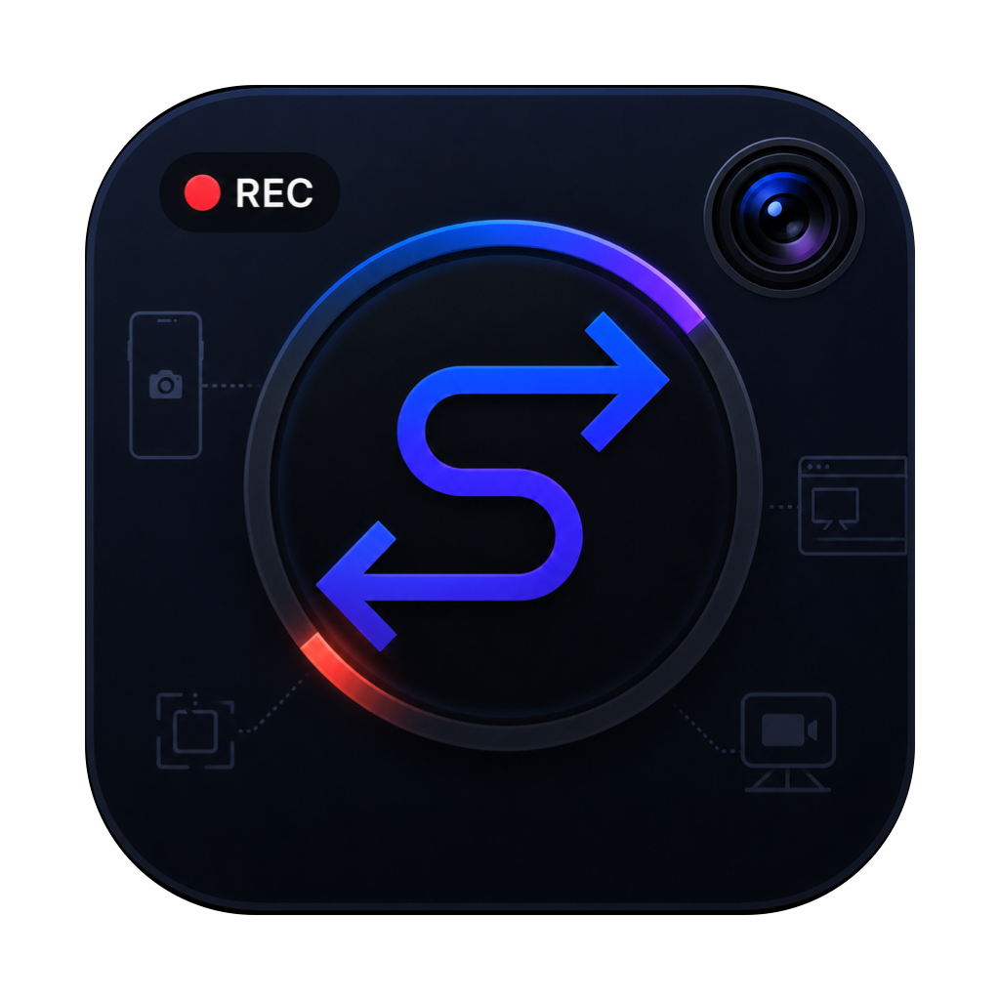
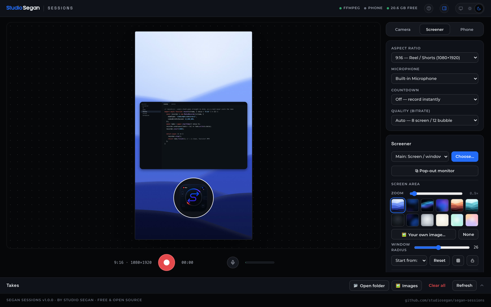
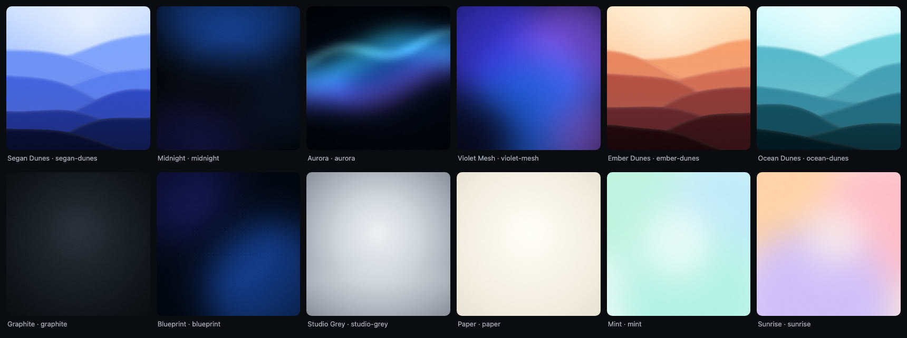

<p align="center">
  
</p>

<h1 align="center">Segan Sessions</h1>

<p align="center">
  <b>A free recording studio for vertical video, on your Mac.</b><br>
  Camera, screen with a face bubble, and your Android phone — saved as clean MP4s, ready to edit.
</p>

<p align="center">
  <a href="#install">Install</a> ·
  <a href="#what-it-does">What it does</a> ·
  <a href="#where-your-files-go">Your files</a> ·
  <a href="#troubleshooting">Help</a> ·
  <a href="#for-developers">Developers</a>
</p>



## Install

Open **Terminal** (press <kbd>⌘</kbd> <kbd>Space</kbd>, type *Terminal*, press <kbd>Return</kbd>), paste this line and press <kbd>Return</kbd>:

```bash
curl -fsSL https://raw.githubusercontent.com/studiosegan/segan-sessions/main/install.sh | bash
```

That is the whole setup. About a minute later **Segan Sessions** is in your Applications folder and opens in Chrome. Drag it to your Dock.

You need:

- a Mac with **macOS 13.5 (Ventura) or newer** — Apple silicon or Intel
- **[Google Chrome](https://www.google.com/chrome/)**
- about **300 MB** of disk for the app and its tools

The installer brings everything else — Node.js, FFmpeg, scrcpy and adb — in its own folder. No Homebrew, no admin password, nothing installed system-wide, and every download is checked against its published SHA-256 before it is used.

## What it does

- **Camera** — records your Mac's camera at full 1080p, with guides for 9:16, 4:5, 1:1 and 16:9.
- **Screener** — records your screen or one window with your face in a bubble (circle or rounded square). Zoom and pan into any part of the screen, blur private areas, and float the window over a background.
- **12 backgrounds included** — original 4K artwork, one click to apply. Or upload your own.
- **Phone** — mirror and control an Android phone over USB or Wi-Fi, record its screen, or pull videos and photos straight off it.
- **Teleprompter** — floats right under your camera; the space bar scrolls it.
- **Records calls** — capture both sides of a meeting with Chrome's *Share system audio*. The app warns you when the other side isn't being recorded.
- **Crash-safe** — footage is written to disk while you record. If Chrome crashes mid-take, the recording saves itself within about two minutes.
- **Takes** — every recording listed with its length, resolution and size; one click turns a take into a cropped, ready-to-post MP4.
- Mic mute (<kbd>M</kbd>), pause, countdown, quality presets, and light and dark themes.



## First run

macOS asks for permissions on behalf of **Chrome**, not Segan Sessions:

1. **Camera and microphone** — Chrome shows a prompt. Click **Allow**.
2. **Screen recording** — the first time you choose a screen, macOS sends you to *System Settings → Privacy & Security → Screen & System Audio Recording*. Turn on **Google Chrome**, then quit and reopen Chrome.

The studio runs only on your Mac, at `http://127.0.0.1:4321`. Nothing is uploaded anywhere.

## Where your files go

| What | Where |
|---|---|
| Camera recordings | `~/Movies/Segan Sessions/Camera` |
| Screen recordings | `~/Movies/Segan Sessions/Screen` |
| Phone videos | `~/Movies/Segan Sessions/Phone` |
| Photos pulled from your phone | `~/Movies/Segan Sessions/Images` |
| Teleprompter scripts (`.md` or `.txt`) | `~/Movies/Segan Sessions/Scripts` |
| The list of takes | `~/Movies/Segan Sessions/takes.json` |

The **Open folder** button in the app takes you straight there. The app itself and its tools live in `~/Library/Application Support/Segan Sessions`.

### Save recordings somewhere else

Want your footage on an external drive, or inside a project folder you already have? Create a file called `config.json` in `~/Library/Application Support/Segan Sessions/`:

```json
{
  "library": "/Volumes/Footage/Segan Sessions"
}
```

Then stop the studio (click **Segan Sessions** in the Dock → **Stop**) and open it again. You can also point each folder and the takes list somewhere else. Paths are relative to `library` unless they start with `/` or `~`:

```json
{
  "library": "~/Projects/my-channel",
  "folders": {
    "camera": "footage/camera",
    "screen": "footage/screen",
    "phone": "footage/phone",
    "images": "footage/photos",
    "scripts": "scripts"
  },
  "takes": "footage/takes.json"
}
```

Recordings you've already made stay where they are.

## Use your Android phone

1. On the phone: **Settings → About phone** → tap **Build number** seven times.
2. **Settings → Developer options** → turn on **USB debugging**.
3. Plug the phone into your Mac with a USB cable that carries data, and tap **Allow** on the phone.

Open the **Phone** tab. Screen mirroring works on any recent Android phone; streaming the phone's camera directly needs Android 12 or newer. For the best quality, shoot in the phone's own camera app and use **Pull from phone**.

## Update or uninstall

**Update** — run the install line again. Your recordings and settings stay.

**Uninstall** — paste this in Terminal:

```bash
curl -fsSL https://raw.githubusercontent.com/studiosegan/segan-sessions/main/uninstall.sh | bash
```

It removes the app and its tools. Your recordings in `~/Movies/Segan Sessions` are never deleted.

## Troubleshooting

**The studio didn't open, or the page won't load.** Click **Segan Sessions** in your Dock. If it's already running, choose **Open**.

**The screen is black when recording.** Chrome needs screen-recording permission (see *First run*). After turning it on, quit and reopen Chrome.

**The other person in my call isn't in the recording.** Choose **Entire Screen** in Chrome's picker and turn on **Share system audio**. The app shows a yellow warning when this is off.

**My phone isn't detected.** Check that USB debugging is on, try another cable or port, and tap **Allow** on the phone's prompt.

**A recording didn't save.** Recordings are written to disk as you record. After a crash the take reappears in **Takes** by itself, marked *recovered from crash*, within about two minutes.

**Something else.** Logs are in `~/Library/Application Support/Segan Sessions/` (`server.log`, and `data/segan-session.log`). Please [open an issue](https://github.com/studiosegan/segan-sessions/issues) and attach them.

## For developers

Segan Sessions is a small Node.js server (no npm dependencies at runtime) and a plain ES-module web page. There is no build step.

```bash
git clone https://github.com/studiosegan/segan-sessions.git
cd segan-sessions
./start.sh        # needs Node.js 20+ and ffmpeg on your PATH (brew install node ffmpeg)
```

Tests drive the real app end to end in headless Chromium:

```bash
npm install       # Playwright, for the tests only
npm test
```

| Variable | Default | |
|---|---|---|
| `SEGAN_LIBRARY` | `~/Movies/Segan Sessions` | where footage is saved |
| `SEGAN_DATA` | `~/Library/Application Support/Segan Sessions/data` | backdrop, thumbnails, logs |
| `PORT` | `4321` | the next free port is used if it's taken |

The backgrounds are drawn in code: `tools/backgrounds/backgrounds.html` (open it in Chrome to preview), rendered by `npm run backgrounds`. The reasoning behind the architecture is in [docs/design-decisions.md](docs/design-decisions.md), and the UI system in [DESIGN.md](DESIGN.md).

Bug reports and pull requests are welcome. By sending a contribution, you agree that Studio Segan may use it under any license, including in paid versions.

## Credits

Made by **[Studio Segan](https://studiosegan.com)**.

It stands on [Node.js](https://nodejs.org), [FFmpeg](https://ffmpeg.org) (static macOS builds by [Martin Riedl](https://ffmpeg.martin-riedl.de)), [scrcpy](https://github.com/Genymobile/scrcpy) by Genymobile, and Android's adb. The installer downloads them from their official sources, and each keeps its own license.

## License

Segan Sessions is **free**, and its code is public: it is *source-available* under the [PolyForm Perimeter License 1.0.0](LICENSE).

- ✅ Use it for free, personally or for paid client work.
- ✅ Change it for your own use.
- ❌ Don't rebrand it, resell it, or offer it (or anything made from it) to others as a competing app, paid or free.

The names *Segan Sessions* and *Studio Segan* and the logo are not covered by the license. The 12 backgrounds are original works by Studio Segan, under the same license.
